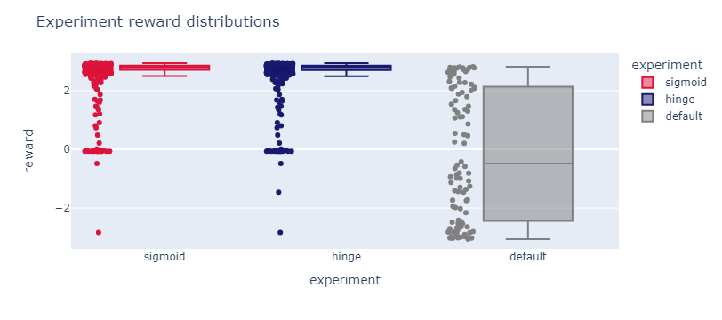
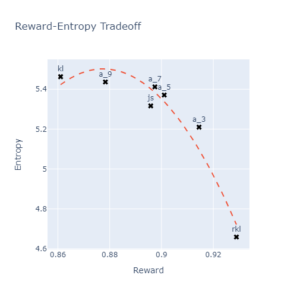
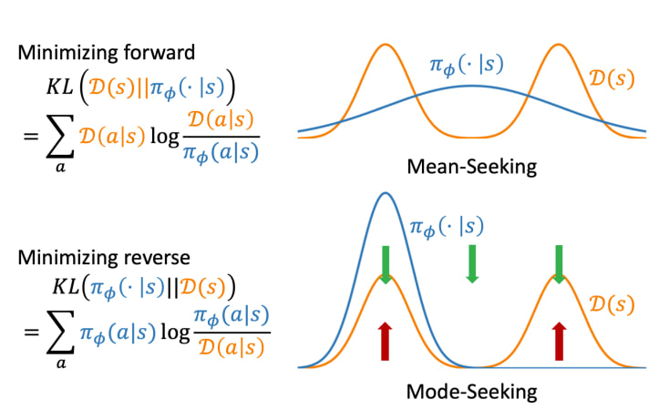
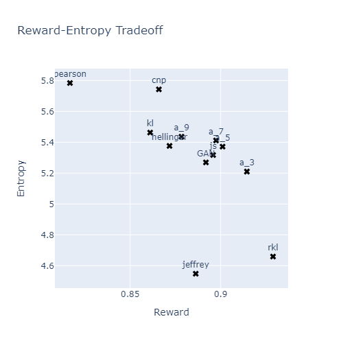

## Отчет 

Это отчёт по задаче воспроизведения результатов статей [Direct Preference Optimization:
Your Language Model is Secretly a Reward Model
](https://arxiv.org/pdf/2305.18290.pdf) и [Beyond Reverse KL: Generalizing Direct Preference Optimization with Diverse Divergence Constraints](https://openreview.net/pdf?id=2cRzmWXK9N). Здесь мы посмотрим, как заставить модель генерировать тексты с каким-то определённым условием, как можно обучить её делать это при помощи DPO архитектуры, как её можно модифицировать при помощи других $f$-дивергенций, и подумаем, как можно это дело улучшить. Про чвсть с кодом лучше смотреть ноутбуки, они тоже подробно описаны, их можно запускать прямо по блокам - все зависимости там есть. Их список внизу отчёта в содержании и по ссылкам в подзаголовках, здесь только общие описания \
[Описание задачи](https://scitator.notion.site/e5db49d792f6476a8b3ce19fd91c6655)

### [Level 1. Loss comparison](https://nbviewer.org/github/Lerostre/test-task-alignment/blob/main/1.%20Loss%20comparison.ipynb)

Одной из первых на данном этапе была задача адаптации модели для генерации более позитивных текстов (поскольку исходная версия модели учится и на позитивных, и на негативных отзывах, соответственно, и генерирует тоже оба класса отзывов). И один из вариантов решения - вставка ключевых слов в промпт, что и было реализовано. В целом при решении были следующие идеи:
- **Beam Search**: во время beam search можно оставлять такие опции, которые не только более вероятны, но и имеют положительную тональность. Это можно сделать, например, при помощи той же gpt2, если взять другую архитектуру, но тогда нужно будет переделывать функцию генерации, что, во-первых, не очень очевидно, во-вторых, придётся оптимизировать, генерация и так весьма медленная
- **The more the better**: генерация как можно большего числа примеров, в надежде набрать достаточно позитивных. Однако этот вариант не является модификацией генерации. Хотя сэмплы для обучения в итоге так и брались
- **(Supervised) fine-tuning**: для реализации этой идеи нужно брать позитивные отзывы, например, из IMDB датасета, однако вновь такой подход не будет адаптацией модели. 
- **Prompt Engineering**: выбран с этой целью `'This movie is great. {to_generate}'`, он даёт результаты, как показано в ноутбуке для этого пункта. Также была попытка вставить другие ключевые слова через bias, чтобы побуждать модель генерировать нужное.

В продолжение эксперимента из этой части считался reward с помощью `"lvwerra/distilbert-imdb"` для каждого из сгенерированных текстов. Все те, у которых reward $\geq$ 2.5, считались положительными (больший `threshold` приводил, например, к тому, что в `rejected` оказывались недостаточно подробные положительные отзывы). Негативными текстами считались те, у которых reward был $<$ 1.75. Если оставлять упомянутый ранее bias, то часть текстов будут сильно похожи друг на друга, поэтому bias лучше убрать. Эту же проблему помогает решить и добавление фильтра по diversity, который, однако, работает весьма долго. 
При обучении SFT модели с лоссом из статьи на созданном из пар winner-loser датасете получаются следующие результаты:

$$
\begin{array}{lllc}
\hline \text{experiment } & \text{reward} & \text{diversity } \\
\hline \text {default} & \text{-0.068486} & \text{5.825884} \\
\text {hinge} & \text{ 2.533579} & \text{4.582645} \\
\text {sigmoid} & \text{ 2.538272} & \text{4.583957} \\
\text {best} & \text{ 2.935000} & \text{4.732000} \\
\hline
\end{array}
$$

Первое, что стоит отметить: reward генерируемых текстов действительно увеличился по сравнению с исходной SFT политикой. Тем не менее, diversity наоборот снизилось, что, в целом, ожидаемо, поскольку мы стараемся генерировать именно позитивные отзывы. Если же сравнивать лоссы (`hinge` и `sigmoid`), то видно, что их значения очень близки и существенной разницы нет.
Внимания заслуживает $\text{best}$ - это распределение из winners, получившееся после отбора кандидатов, пожалуй, его можно взять, как пример распределения, к которому надо стремиться.

Итоговый график вот такой. Да, `DPOTrainer` работает, отзывы действительно становятся сильно позитивнее:

### [Level 2. F-divergences](https://nbviewer.org/github/Lerostre/test-task-alignment/blob/main/2.%20F-divergences.ipynb)

Здесь, в первую очередь, стоит заметить, что лосс в обобщённом виде, где $f′$ -- это производная произвольной дивергенции, в `DPOTrainer` является обратной КЛ-дивергенцией, которую и нужно менять. Опорой для кода в этом задании служит таблица с уже посчитанными производными:

$$
\begin{array}{lllc}
\hline f \text {-divergence } & \boldsymbol{f}(\boldsymbol{u}) & \boldsymbol{f}^{\prime}(\boldsymbol{u}) \\
\hline \alpha \text {-divergence }(\alpha \in(0,1)) & \left(u^{1-\alpha}-(1-\alpha) u-\alpha\right) /(\alpha(\alpha-1)) & \left(1-u^{-\alpha}\right) / \alpha\\
\text { Reverse KL }(\alpha=0) & u \log u & \log u+1\\
\text { Forward KL }(\alpha=1) & -\log u & -1 / u\\
\text { JS-divergence } & u \log u-(u+1) \log ((u+1) / 2) & \log (2 u /(1+u))\\
\hline
\end{array}
$$

В файле `utils.py` содержатся функции потерь, которые получаются из других функций дивергенции. А именно:
- `RKL_divergence`
- `KL_divergence`
- `alpha_divergence`
- `JS_divergence`
  
То, как функции встроены, содержится в `pipeline.py`.
График, который был получен в результате, отличается от представленного в статье:

Возникнуть такая ситуация могла по следующим причинам:
- Были использованы не промпты из датасета IMDB, как в статье, а авторские.
- Diversity уже изначально было неплохим в силу использования других промптов.
- Разный подход к обучению моделей. В статье модель обучалась до полной сходимости и на большем количестве примеров, здесь же количество примеров было ограничено имеющимися ресурсами, кроме того, число эпох было определено экспериментально, поскольку на валидации было заметно переобучение.
Тем не менее, общая картина получилась очень похожей на ту, что показана в статье. И важно, что информация на графике интерпретируема. Так, $\text{KL}$ создает разнообразные тексты, в том числе, негативные, так что reward получается меньше, а entropy - довольно высокой. $\text{RKL}$ же ведет себя иначе, поскольку не является zero-forcing

### [Level 3. Improvements](https://nbviewer.org/github/Lerostre/test-task-alignment/blob/main/3.%20Improvements.ipynb)

Способы улучшить представленные методы: 
Основной идеей здесь была попытка протестировать другие функции дивергенции и посмотреть, как они влияют на поведение модели. Часть из них -- $\text{Total Variation}$ и $\text{Chi-squared}$ - уже была представлена в статье, но не рассмотрена подробно.

$$
\begin{array}{lllc}
\hline f \text {-divergence } & \boldsymbol{f}(\boldsymbol{u}) & \boldsymbol{f}^{\prime}(\boldsymbol{u}) \\
\hline
\text { Pearson } \chi^2 & (u-1)^2 & 2(u-1)\\
\text { Neyman } \chi^2 & (1-u)^2 / u & 1 - \frac{1}{u^2}\\
\text { CNP }  \chi^2 & \frac{1}{3} \left(2\chi^2_{\text{Pearson}} + \chi^2_{\text{Neyman}} \right) & \frac{1}{3} \left( 4u - 3 - \frac{1}{u^2}\right)\\
\text { Hellinger } & (\sqrt{u}-1)^2 & 1 - \frac{1}{\sqrt{u}}\\
\text { Jeffrey } & (u-1)\log{u} &  \log u + 1 - \frac{1}{u}\\
\text { GAN } & u\log{u} - (u+1)\log(u+1) & \log u - \log(u+1)\\
\text { Total Variation } & \frac{1}{2}|u-1| & u>1 ? \frac{1}{2}:-\frac{1}{2}\\
\chi^{\alpha} \ \text {distance} \ (\alpha > 1) & \frac{1}{2}|u-1|^{\alpha} & u>1 ? \frac{\alpha(u-1)^{\alpha-1}}{2}:-\frac{\alpha(1-u)^{\alpha-1}}{2}\\
\hline
\end{array}
$$

К сожалению, сложно сказать, какая из них окажется лучшей, их свойства не так доступны для понимания, как у остальных. Пока что у нас чисто исследовательские цели, интерпретацию оставим на потом.
Что-то по итогу удалось достичь с $\text{CNP} \ \chi^2$ - она сильно повышает diversity, сохраняя при этом reward КЛ-дивергенции, что возможно неплохо. Подробнее в ноутбуке. Были также попытки улучшить качество через лоссы `ipo` и `kto`, но это не сильно могло. Возможно, они становятся лучше при альтернативных функциях дивергенции

### Содержание репозитория

- [**1. Loss comparison.ipynb**](https://nbviewer.org/github/Lerostre/test-task-alignment/blob/main/1.%20Loss%20comparison.ipynb) - Тут есть подробное описание процедуры генерации условных отзывов, обучение `DPOTrainer`, наглядное сравнение лоссов - через графики распределений, через анализ промптов и так далее. Это про анализ статьи про DPO
- [**2. F-divergences.ipynb**](https://nbviewer.org/github/Lerostre/test-task-alignment/blob/main/2.%20F-divergences.ipynb) - Тут лежит влияние разных дивергенций на баланс между diversity и reward. Соответствует статье 'Beyond RKL'
- [**3. Improvements.ipynb**](https://nbviewer.org/github/Lerostre/test-task-alignment/blob/main/3.%20Improvements.ipynb) - Здесь есть немного попыток улучшить модель, единственное, что не хватает осмысленного анализа
- [**pipeline.py**](https://github.com/Lerostre/test-task-alignment/blob/main/pipeline.py) - В этом модуле лежит всё, что нужно для общего пайплайна обучения. Генерация промптов, обучение модели, генерация новых отзывов, аггрегация и хранение данных
- [**utils.py**](https://github.com/Lerostre/test-task-alignment/blob/main/utils.py) - Здесь разные мелкие функции, например, генерация сида, $f$-дивергенции и прочее
- [**trainers.py**](https://github.com/Lerostre/test-task-alignment/blob/main/trainers.py) - Здесь лишь один модифицированный для пункта 2 `DPOTrainer`. Планировалось сделать ещё другие, по аналогии с репозиторием HALO, но до этого руки так и не дошли
- [**readme.md**](#report) - Это собственно отчёт о проделанной работе
- [**./experiments**](https://github.com/Lerostre/test-task-alignment/tree/main/experiments) - В этой папке все эксперименты. В основном это целая куча разных генераций модели, например, с hinge-лоссом, с rkl-дивергенцией и прочее
- [**./src**](https://github.com/Lerostre/test-task-alignment/tree/main/src) - Здесь лежат картинки для отчёта
- [**./hf_dataset**](https://github.com/Lerostre/test-task-alignment/tree/main/hf_dataset) - Это датасет из пар winner-loser, использованный для обучения
